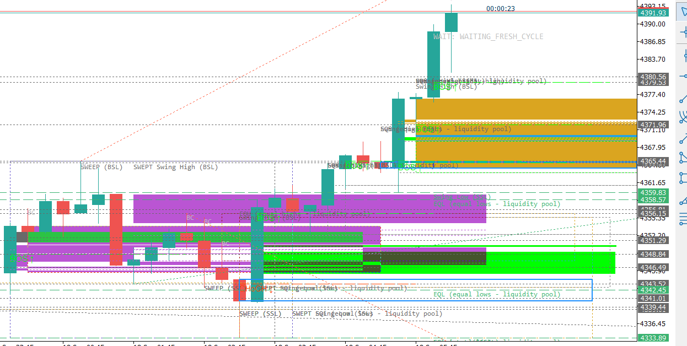

# ICT Assistant — Multi-School Price Action Indicator for MetaTrader 5

A free, open-source **MetaTrader 5 indicator** that brings **nine trading schools** together in one chart tool:

**ICT (Inner Circle Trader) · SMC (Smart Money Concepts) · Market Maker Model (MMM) · Wyckoff · Supply & Demand · Auction Market Theory / Market Profile · Volume Profile (tick-volume approximation) · RTM (Read The Market) · Al Brooks Price Action**

It is both an **indicator and a teacher**: click on any line, zone or event and a Persian explanation panel opens — what the object is, why it formed, what validates it, what invalidates it, and how to verify the number by hand on your own chart.



*XAUUSD M15 — order blocks, FVGs, liquidity pools (EQH/EQL, BSL/SSL) and swept swings, drawn live by the indicator.*

> **Try it without MetaTrader:** [interactive demo](https://khalegh2131.github.io/ICT_indicator/) — click the numbered spots on the chart to see exactly what the explanation panel says.
> **فارسی:** [راهنمای کامل فارسی](https://khalegh2131.github.io/ICT_indicator/guide.html)

> **Copyright © Khaleq Salehi** — khaleq.sa@gmail.com
> Licensed under the MIT License (see [LICENSE](LICENSE)).

---

## Why this indicator is different

| Most SMC indicators | This one |
|---|---|
| Draw a level, no reason given | Every object carries a **click-to-learn panel** with the rule behind it |
| Recalculate with repaint | Analysis runs on **closed bars only**; pivots confirm before they publish |
| One global model across all timeframes | **Each timeframe works independently** with its own registry and drawing |
| Clutter that grows forever | Registry caps, FIFO expiry, and invalidated history are **removed automatically** |
| Vague claims | Every operational definition is documented, and **21 rule validators** lock the rules |
| Nothing proving the arithmetic | A behavior harness runs 25 synthetic-candle scenarios through the **real detection functions** and compares the numbers against an independent recomputation |

## Feature overview

**Structure & direction** — BOS, CHoCH / MSS with no-repaint pivots · swing engine with protected highs/lows · H4 bias ownership (lower timeframes can confirm or reject a setup but never flip H4 bias).

**Liquidity** — PDH/PDL, PWH/PWL, EQH/EQL with separation rules · BSL/SSL · session, range and trendline liquidity · IPDA old high/low reference levels (20/40/60 days) · sweep / stop-hunt / Judas swing detection with wick-plus-close confirmation.

**Zones & inefficiency** — FVG (Standard, Inverted, Implied, Micro, BISI/SIBI labels, Consequent Encroachment line) · Order Blocks (Bullish/Bearish, Extreme, Internal/External, Core/Standalone) · Breaker Blocks with mandatory sweep + separate-candle retest · Mitigation Blocks · Rejection Blocks · Supply & Demand (RBR / DBR / RBD / DBD, Fresh/Tested/Flipped/Broken, zone strength score).

**Context & timing** — New York timezone sessions, Asian range, London & NY killzones · Silver Bullet windows with HTF-LTF sync state · Quarterly Theory (Q1–Q4 with True Day / True Week opens) · AMD both as session mapping and as measured price stage.

**Measured context** — Premium/Discount equilibrium (50% fib) · OTE zone (0.62–0.79 with 0.705 golden window) · PD-Array / POI registry with quality scoring and nested-mitigation bonus · Dealing-range leg tracking ("how far has price traveled").

**School engines** — Wyckoff (SC/BC/AR/ST/Spring/Upthrust/SOS/SOW/LPS/LPSY/Test/Absorption with phases A–E) · Market Profile (POC, Value Area, HVN/LVN, Initial Balance, TPO count, Naked POC, day & open types) · Al Brooks (trend bars, signal/entry/follow-through bars, H1–H4 / L1–L4 pullback counts, Always-In state, 20 EMA, Trading Ranges with 50% magnet, Measured Moves AB=CD, channel slope) · RTM (flip zones, trap entries, momentum & compression reads) · Smart Money Reversal score (four counted evidences, configurable threshold).

**Reverse-risk strip** — a single-line on-chart bar showing the nearest level, its type/state, distance in ATR, leg progress, and a documented reversal-risk score so you always know *where you stand* without opening a CSV.

**Education mode** — click (or press the configured key and hover) any object: the panel explains the concept, the exact rule that created it, what would invalidate it, and how to recompute the number manually.

## Installation

1. Copy `08_FINAL_PACKAGE/ICT_Assistant_Canonical_v0_1/ICT_Assistant_Canonical_v0_1.mq5` **and** its
   `modules/` folder into `MQL5\Indicators\` (any subfolder you like, but keep the two together —
   the shell resolves `modules/...` relative to itself). To skip this step entirely, download the
   compiled `.ex5` from the [latest release](https://github.com/khalegh2131/ICT_indicator/releases/latest) instead.
2. Open MetaEditor (F4 in the terminal) and compile — the file builds with **0 errors, 0 warnings** on a current MT5 build.
3. In the Navigator, right-click → **Refresh**, then drag the indicator onto an XAUUSD chart (other symbols work; defaults are tuned for gold).
4. Chart stays clean by default. Open the explanation panel by holding the configured key (default **Ctrl**) while hovering an object; the panel opens on **click** in the default profile.

> Recommended: enable **Tools → Options → Charts → Show object descriptions** only if you want object name labels; the indicator hides them by default for a clean chart.

## Usage tips

- **Chart too busy?** Lower `InpMaxDrawnLevels` / `InpMaxDrawnZones`, or switch whole layers off — every family has its own toggle and its own timeframe scope.
- **Want the dashboard?** `InpShowDashboard=true` (off by default; the one-line risk strip replaces it).
- **Explanations:** `InpExplainOpen` chooses how the panel opens — `EXPLAIN_OPEN_CLICK` (default; the mouse stays free) or `EXPLAIN_OPEN_HOVER` (hold the pointer over an object). Close it with Esc or the next click. Panel sizing lives in `InpExplainPanelWidth` / `InpExplainFontSize` / `InpExplainMaxRows`, and `InpExplainRenderMode` is documented in `07_DOCUMENTATION/`.
- **Performance:** heavy analysis runs once per closed bar, not per tick; registries are capped and expired objects are deleted, so the chart stays fast on M1.

## Repository layout

```
01_CANONICAL_CANDIDATES/   the canonical shell (.mq5) + modules/ — one .mqh per strategy family
05_TESTS_AND_VALIDATION/   CSV fixtures for the validators
07_DOCUMENTATION/          architecture, audits, validation plan, research notes
08_FINAL_PACKAGE/          ready-to-compile package
docs/                      GitHub Pages site: landing page, interactive demo, Persian guide
tools/                     sync-compile pipeline, module-split verifier + 21 rule validators (PowerShell)
```

The build pipeline (`tools/Sync-And-Compile-Canonical.ps1`) mirrors the shell plus all 30 modules to your MT5 data folder, proves the split still reassembles to the reviewed source (`tools/Verify-ModuleSplit.ps1`), and only then compiles. It verifies every copied file by hash and checks artifact freshness by timestamp — it never trusts exit codes alone.

### Where the code lives

The canonical source used to be one 11,068-line file. It is now a shell plus 30 contiguous slices, one per strategy family (`01_CANONICAL_CANDIDATES/modules/`, index in its `README.md`). The slices are taken in the original order and included in that same order, so the compiled translation unit is unchanged — global, struct and enum declaration order is preserved. `tools/Verify-ModuleSplit.ps1` reassembles shell + modules exactly the way the MQL5 preprocessor does and requires it to match a frozen SHA256, so the split is provable rather than asserted; the build refuses to run if that check fails.

## Design rules this project commits to

1. **Closed-bar only.** No signal is finalized on the forming candle; pivot-based events publish only after right-side confirmation.
2. **No hidden multi-timeframe coupling.** Each chart timeframe owns its objects; higher-timeframe context is read as data, never as a re-draw.
3. **Honest scope.** Real order-flow / footprint / delta is impossible from native MT5 forex data (tick-volume only) — the Volume Profile family is explicitly labeled an approximation and no unverified volume claims are made.
4. **Documented operational definitions.** Where a school has competing definitions (e.g. Smart Money Reversal), the exact rule used is written down and locked by a validator.
5. **Expiry over clutter.** Invalidated objects are deleted, not piled up; display caps use FIFO so history never silently disappears mid-session.

## Honest limitations

- Stop distance is currently a fixed buffer, not ATR-aware, and does not yet respect `SYMBOL_TRADE_STOPS_LEVEL`.
- Volume-based metrics (Profile family, Effort vs Result) use **tick volume**, not real traded volume.
- The reversal-risk score is a weighted-evidence sum, not a calibrated probability; per-level hit-rate statistics require runtime CSV collection (tooling included, data not).
- Not a trading robot; it does not place or manage orders, and it is **not financial advice**.

## Verifying the arithmetic

Most indicator repositories ask you to trust them. This one ships three independent ways to check it:

1. **The explanation panel itself** tells you how to recompute the number by hand — which bars, which boundary, which condition.
2. **21 rule validators** in `tools/` lock the operational definitions against silent drift.
3. **A behavior harness on synthetic data.** The indicator can run 25 hand-built candle scenarios (FVG geometry, the minimum-gap guard, the implied-FVG mid-wick formula, volume imbalance, order-block origin bar and lookback, sweep confirmation and nearest-level ownership) through the *real* `DetectFVG` / `DetectOB` / `DetectSweep` functions and write `ICT_Assistant_Canonical_SelfTest.csv`. `tools/Validate-Phase37.ps1` recomputes every expected number independently and requires the report to match — and it requires exactly **one deliberately failing** sensitivity row, so a report that cannot fail is rejected rather than celebrated.

## Contributing

Issues and pull requests are welcome. Please keep changes consistent with the closed-bar/no-repaint rules and run the relevant validator scripts in `tools/` before submitting.

## License

Released under the [MIT License](LICENSE) — free to use, modify and redistribute with attribution.

> **Trading disclaimer:** This software is provided for educational and analytical purposes only and does not provide financial advice. Trading foreign exchange and CFDs on margin carries a high level of risk and may not be suitable for all investors. Past performance of any indicator or strategy is not indicative of future results. The authors and contributors accept no responsibility for any financial losses incurred through the use of this software — always test on a demo account first and never risk capital you cannot afford to lose.

---

*MetaTrader 5 and MetaEditor are trademarks of MetaQuotes Software Corp. This project is not affiliated with or endorsed by MetaQuotes. References to trading schools (ICT, SMC, Wyckoff, etc.) are for educational identification of public concepts only.*
